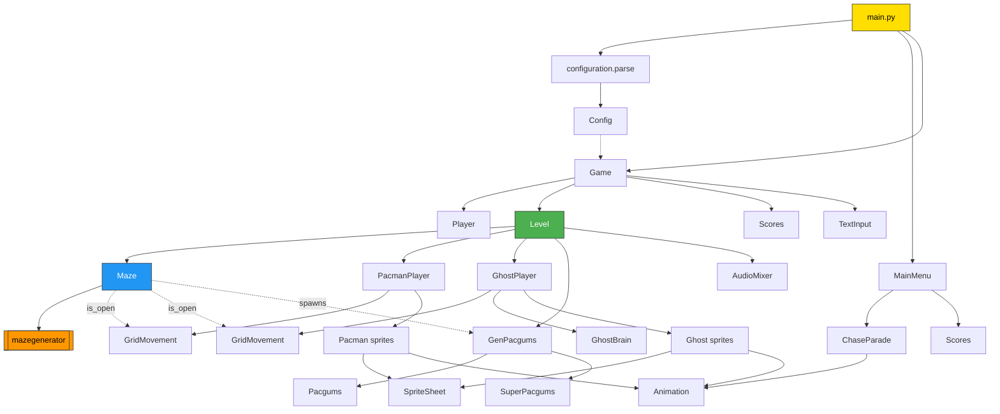

*This activity has been created as part of the 42 curriculum by halexand, mschyns.*

<div align="center">

# ⣿ PAC-MAN 42 ⣿

**An arcade Pac-Man rebuilt on procedurally generated mazes.**

[](https://www.python.org/)
[](https://pyga.me/)
[](https://docs.pydantic.dev/)
[](https://flake8.pycqa.org/)
[](https://mypy-lang.org/)

</div>

---

## Table of Contents

| Section | What you will find |
| :--- | :--- |
| [Description](#description) | What this activity is and what it delivers |
| [Instructions](#instructions) | Install, run, controls, tooling, packaging |
| [Configuration](#configuration) | The JSON config file, every key, every default |
| [Highscore](#highscore) | How scores are stored and why |
| [Maze Generation](#maze-generation) | How the A-Maze-ing package drives every level |
| [Implementation](#implementation) | Technical summary of the moving parts |
| [General Software Architecture](#general-software-architecture) | Modules, classes and how they relate |
| [Project Management](#project-management) | How the two of us worked |
| [Resources](#resources) | References |

---

## Description

**Pac-Man 42** is a complete rewrite of the 1980 Namco arcade classic in Python and
`pygame-ce`, built as a 42 common-core group activity.

The twist over the original: **there is no hand-drawn maze**. Every level is
generated at runtime by the *A-Maze-ing* package imposed by the subject, so the
board is different on every run — and yet fully reproducible thanks to a seed
written in the configuration file. The player never plays the same game twice,
and the team can still replay a specific bug on demand.

**The goal** is to clear a campaign of levels — at least ten, defined in a JSON
config file. A level is cleared when every pac-gum on the board has been eaten,
before the timer runs out and while lives remain. Four ghosts, each with its own
personality and its own targeting AI, hunt the player across the maze. Eating a
super pac-gum flips the balance: ghosts turn blue, flee, and become worth points
for a few seconds.

### Feature list

| | Feature |
| :--- | :--- |
| 🌀 | **Procedural mazes** — a new labyrinth per level, sized by the config, seeded and reproducible |
| 👻 | **Four distinct ghost AIs** — direct chase, ambush, flanking and cowardice, each a separate `GhostBrain` |
| 📈 | **Difficulty curve** — ghost speed and aggressiveness scale with the level, vulnerability windows shrink |
| 🎮 | **Grid-locked movement** — buffered turn input with tolerance, so corners feel arcade-tight |
| 🕹️ | **Animated arcade menu** — bouncing logo, chase parade, highscore and instruction pages |
| 🔊 | **Full audio mix** — sliced from a single sound bank, 8 channels, sirens, waka loop and ducking |
| 💾 | **Persistent highscores** — validated, sorted, top-10, corruption-proof |
| 🧾 | **Forgiving JSON config** — comments allowed, every invalid field falls back to a sane default |
| 📦 | **Single-file distribution** — PyInstaller build producing a standalone `pacman_42` executable |
| ✅ | **Fully typed and linted** — `flake8` clean, `mypy` clean under strict-ish flags |

---

## Instructions

### Requirements

- **Python 3.11 or newer** (the codebase uses PEP 604 unions and PEP 585 generics)
- `python3-venv` available
- A working audio output device (the game initialises `pygame.mixer` at startup)

Everything else is installed into a local virtual environment — nothing is
installed system-wide.

### Installation

```bash
git clone git@github.com:ManoSchyns/pacman.git
cd pacman
make install
```

`make install` creates the `pacman_env/` virtual environment and installs
`requirements.txt` into it, including the vendored *A-Maze-ing* wheel located at
`maze/lib/mazegenerator-00001-py3-none-any.whl`.

### Running the game

```bash
make run
```

This is a shortcut for:

```bash
pacman_env/bin/python main.py config.json
```

The program takes **exactly one argument**: the path to a `.json` configuration
file. Any other number of arguments, a non-`.json` extension, an unreadable file
or malformed JSON aborts the launch with an explicit message.

```bash
pacman_env/bin/python main.py my_custom_config.json
```

### Controls

| Key | Action |
| :--- | :--- |
| <kbd>↑</kbd> <kbd>↓</kbd> <kbd>←</kbd> <kbd>→</kbd> | Move Pac-Man / navigate the menu |
| <kbd>Enter</kbd> / <kbd>Space</kbd> | Validate a menu entry |
| <kbd>Esc</kbd> | Pause the game (in-level) / go back (in a menu page) |
| <kbd>Space</kbd> | Skip the current level — debug shortcut, kept on purpose |
| Mouse | Hover and click the menu entries |

Any key resumes from the "Press any key !" screen shown before a level and after
losing a life.

### Development commands

| Command | Effect |
| :--- | :--- |
| `make install` | Create `pacman_env/` and install every dependency |
| `make run` | Launch the game with `config.json` |
| `make debug` | Launch `main.py` under `pdb` |
| `make lint` | `flake8` + `mypy` with the project flags |
| `make lint-strict` | `flake8` + `mypy --strict` |
| `make clean` | Remove every `__pycache__` and the `mypy` cache |
| `make package` | Build the standalone distributable |

Lint configuration lives in `setup.cfg`: 79-column limit, `pacman_env/`,
`.mypy_cache/`, `build/` and `dist/` excluded.

### Packaging

```bash
make package
```

`package.sh` runs PyInstaller in `--onefile` mode, bundling the sprite sheet, the
arcade fonts and the audio bank into a single binary, then ships everything as
`pacman_42.zip`:

```
pacman_42.zip
├── pacman_42      # standalone executable, no Python required
├── config.json    # a working default configuration
└── README.md      # short end-user manual
```

To play from the archive:

```bash
unzip pacman_42.zip && ./pacman_42 config.json
```

> **Note** — the executable is built for the platform it was packaged on. Rebuild
> it on the target OS if you need to distribute elsewhere.

---

## Configuration

The game is entirely driven by a JSON file passed on the command line. The parser
lives in `configuration/parsing.py`, the validation model in
`configuration/configuration.py`.

### Structure

```jsonc
{
    // Lines starting with # or // are stripped before parsing
    "level_list": [
        [35, 35],
        [25, 25],
        [20, 21],
        [30, 30],
        [27, 10],
        [10, 10],
        [26, 27],
        [26, 17],
        [15, 13],
        [10, 5]
    ],
    "number_pacgum": 10,
    "points_per_pacgum": 10,
    "points_per_super_pacgum": 20,
    "points_per_ghost": 30,
    "lives": 10,
    "seed": 30,
    "level_max_time": 100
}
```

### Keys and default values

| Key | Type | Default | Constraints |
| :--- | :--- | :---: | :--- |
| `level_list` | list of `[width, height]` | 10 built-in levels | At least **10 valid** levels; each dimension in **7 – 50** |
| `number_pacgum` | int | `42` | ≥ 1 — normal pac-gums per maze |
| `points_per_pacgum` | int | `10` | ≥ 1 |
| `points_per_super_pacgum` | int | `20` | ≥ 1 |
| `points_per_ghost` | int | `40` | ≥ 1 — awarded per ghost eaten while vulnerable |
| `lives` | int | `3` | ≥ 1 |
| `seed` | int | `42` | ≥ 0 — seed of the **first** maze |
| `level_max_time` | int | `100` | ≥ 1 — seconds allowed per level |

### Parsing philosophy: never crash on a bad config

The config file is player-facing, so a typo must never take the game down. Only
two situations are fatal — a file that cannot be read, and JSON that cannot be
decoded. Everything else is *repaired and reported*:

1. **Comments are stripped.** Any line starting with `#` or `//` is removed
   before `json.loads`, so a config can be documented in place.
2. **Missing keys are announced**, then filled with the table default above.
3. **Invalid values are announced**, then replaced field by field — a broken
   `lives` never invalidates a perfectly good `seed`.
4. **`level_list` is repaired entry by entry.** Malformed entries (not a pair,
   non-integer, dimension outside 7–50) are dropped with a message, and if fewer
   than 10 valid levels remain, the list is topped up from the built-in default
   set. A campaign is therefore *always* at least 10 levels long, as the subject
   requires.

The lower bound of 7 is not arbitrary: below that, *A-Maze-ing* cannot fit its
`42` pattern inside the grid. The upper bound of 50 keeps corridors wide enough
to stay playable in a 1000×1000 window.

> **One asymmetry worth knowing** — if `lives` is *absent*, the pydantic default
> `3` applies; if it is *present but invalid*, the field validator substitutes
> `1`. Every other field uses the same value in both cases.

---

## Highscore

### How it works

Scores live in **`scores.json`**, next to the game, as a flat name → score map:

```json
{
    "Henry": 1940,
    "Mano": 30
}
```

The lifecycle is handled by the `Scores` class (`score/scores.py`):

| Step | Behaviour |
| :--- | :--- |
| **Load** | The file is read at startup of the highscore page and at game over |
| **Validate** | Every entry is checked; invalid ones are dropped and reported |
| **Insert** | The end-of-game screen asks for a name and registers the run |
| **Sort & trim** | Entries are sorted descending and truncated to the **top 10** |
| **Save** | The trimmed table is written back with `indent=4` |

Validation rules for an entry to survive:

- the **name** is a string of **1 to 10 characters**, alphanumeric or spaces only;
- the **score** is a **positive integer**.

The same validation runs on the player's input at the end screen
(`Player.verify_name`), so the rejection message is shown *before* saving rather
than silently dropping the run.

### Why this design

- **Human-readable JSON, not a binary or a database.** A corrector, a peer or a
  teammate can open the file, read it, edit it, and delete a bogus entry with a
  text editor. For ten integers, anything heavier than JSON is dead weight — and
  it costs zero dependencies since `json` is in the standard library.
- **Validation on read, not just on write.** The file is user-editable by design,
  which means it is also user-breakable. Rather than trusting it, every entry is
  re-validated on load; bad ones are dropped with a message naming the offender.
  A hand-edited `"score": "lots"` cannot crash the menu.
- **Corruption is survivable, never silent.** If the JSON no longer parses, the
  raw file is copied to **`scores_backup.json`** before the game starts from an
  empty table. The player is told the backup exists. Nothing is ever destroyed
  without a copy.
- **Top 10 only.** The arcade original showed a short board; an unbounded file
  would grow forever and the menu page would need scrolling for no benefit.
- **Written at game over, not continuously.** A single write per run keeps the
  60 FPS loop free of any disk I/O.

---

## Maze Generation

Every level is built by the **A-Maze-ing** package (`mazegenerator` 2.0.2),
vendored as a wheel in `maze/lib/` and installed through `requirements.txt`.
All of the integration lives in the single `Maze` class (`maze/classes/maze.py`).

### Calling the package

```python
from mazegenerator import MazeGenerator

self._maze_gen = MazeGenerator(size=(width, height), seed=seed)
self._maze = self._maze_gen.maze
```

The generator returns a 2D grid of integers. Each cell packs its four walls into
the low bits, and cells belonging to the mandatory `42` pattern carry the special
value `15` (all four walls up, i.e. a solid block):

| Bit | Value | Wall |
| :---: | :---: | :--- |
| 0 | `1` | North |
| 1 | `2` | East |
| 2 | `4` | South |
| 3 | `8` | West |

The package's `shortest_path`, `maze_entry` and `maze_exit` properties are not
used: Pac-Man has no exit to reach, the objective is board coverage, so the game
only needs the topology.

### From bitmask to a playable board

`Maze` turns that grid into everything a level needs:

**1 — Rendering.** Each cell only draws its **North** and **East** walls, plus the
**South** wall on the last row and the **West** wall on the first column. Since
adjacent cells encode a shared wall twice, this halves the draw calls and
guarantees a uniform 5 px stroke with no double-thickness seams. Walls are drawn
in orange, `42`-pattern cells are filled in red. The whole maze is rasterised
**once** into a `pygame.Surface` at construction time and blitted every frame.

**2 — Collision.** While drawing, every wall segment is also appended to a
`list[pygame.Rect]`, giving a cheap rectangle-based collision test for anything
that needs one.

**3 — Navigation.** The real movement contract is `Maze.is_open(cell, direction)`:
a single predicate that answers *"can something in this cell step that way?"* It
checks the relevant wall bit — reading it from the neighbour when the wall is
encoded there — verifies the target is inside the grid, and refuses cells whose
value is `15`. **Pac-Man and all four ghosts navigate exclusively through this
one function**, so the player and the AI can never disagree about what a wall is.

**4 — Scaling.** Cell size is derived from the window, not fixed:
`min(screen_width // width, (screen_height - 50) // height)`, reserving 50 px for
the HUD. A 10×5 maze and a 50×50 maze both fill the window correctly. Pac-Man and
the ghosts are sized at 70 % of a corridor so they visibly fit inside it.

**5 — Spawns.** Placement is derived from the generated topology:

| Entity | Rule |
| :--- | :--- |
| Pac-Man | Centre of the maze, scanning downwards while the cell is part of the `42` block |
| Ghosts | The four corners, each folded to the **nearest free cell** if the corner is solid |
| Super pac-gums | The same four corners — maximum distance from the player's spawn |
| Pac-gums | `number_pacgum` cells drawn at random from every free cell, excluding spawns and centre |

### Seeding and reproducibility

The **first** maze uses the `seed` from the config, so a full campaign can be
replayed identically — invaluable when a bug only shows up on one particular
layout. Every subsequent level then draws a fresh random seed from an unseeded
`random.Random()`, so a run stays surprising after the first board.

### Failure handling

The subject warns that the assigned package may be non-functional. `Level`
therefore wraps maze construction:

```python
try:
    self.maze = Maze(width, height, screen, seed)
except Exception:
    print("Error during maze generation. "
          "The provided package is non-functional.")
    sys.exit(1)
```

The game reports the cause and exits cleanly rather than dying inside a traceback.

---

## Implementation

### Grid movement — one engine for every actor

`GridMovement` (`pacman/classes/movement.py`) is the heart of the gameplay feel,
and it is shared verbatim by Pac-Man and the four ghosts. Only the *source* of
the direction changes: the keyboard for the player, a `GhostBrain` for the AI.

- **Buffered input.** A direction request is stored in `wanted_direction` and
  applied only when legal. Pressing ↑ slightly before an intersection still
  turns, instead of being swallowed.
- **Turn tolerance.** A turn is accepted within 25 % of a cell around its centre,
  then the actor is snapped to that centre. This is what makes corners forgiving
  without ever letting anything drift off-grid.
- **Instant U-turns.** Reversing is always legal and immediate — no need to reach
  a centre, matching the arcade original.
- **Wall-safe stepping.** `_advance` never moves in one jump. It consumes the
  remaining distance cell by cell, checking `is_open` at each boundary, and stops
  flush against a wall. At any frame rate, nothing can tunnel through a wall.
- **`dt` clamping.** The delta time is capped at `1/30 s`, so a stutter or a
  window drag cannot teleport an actor across the board.
- **Spawn cooldown.** `can_move()` freezes an actor for a few seconds after
  spawning — 2 s at level start, 5 s for a ghost that has just been eaten, which
  is what makes eating a ghost actually rewarding.

### Ghost AI — four brains, one algorithm

Every ghost runs the same decision loop, and only its **target cell** changes.
That single point of variation is what produces four recognisable personalities
from ~150 lines (`ghost/classes/brain.py`).

| Ghost | Brain | Target |
| :--- | :--- | :--- |
| 🔴 **Blinky** | `GhostBrain` | Pac-Man's cell — relentless direct pursuit |
| 🩷 **Pinky** | `AmbushBrain` | 4 cells **ahead** of Pac-Man — cuts him off |
| 🩵 **Inky** | `FlankBrain` | Pac-Man's cell when far; when close, the point symmetric to Blinky through a pivot 2 cells ahead of Pac-Man — pincers with Blinky |
| 🟠 **Clyde** | `CowardBrain` | Pac-Man when far; his own corner as soon as he is within 8 cells — breaks the pack |

The shared decision procedure:

1. **Decide once per cell.** `last_decision_cell` prevents re-deciding inside the
   same cell, which would produce jitter at intersections.
2. **Never reverse.** The opposite of the current direction is excluded from the
   options, so ghosts flow through the maze instead of oscillating.
3. **Pick the greedy option.** Among the open directions, take the one minimising
   the *squared* Euclidean distance to the target — squared, because comparing
   distances never needs the square root.
4. **Add noise.** With a per-ghost probability, take a random legal turn instead.
   Pure greedy pursuit is trivially exploitable; a little unpredictability is what
   makes them feel alive.
5. **Invert when afraid.** While vulnerable, the ghost *maximises* distance to
   Pac-Man, and is additionally allowed to reverse when it is aligned with him on
   a row or a column — exactly the situation where fleeing forward is suicide.

### Difficulty scaling

Every knob is derived from the current level index, in `Level.reset_ghosts` and
`Level.try_eat`:

| Parameter | Level 1 | Progression | Cap |
| :--- | :---: | :--- | :---: |
| Blinky & Inky speed | 3.0 cells/s | +0.25 per level | 4.5 |
| Pinky & Clyde speed | 3.0 cells/s | +0.05 per level | 4.2 |
| Pinky random turns | 25 % | −2 pts per level | 5 % |
| Vulnerability window | ~8 s | shrinks as levels are cleared | 10 s |

Pac-Man's speed stays constant at 4 cells/s. The player never gets faster — the
maze gets more dangerous. Vulnerability is computed from the *remaining* levels,
so the super pac-gum is a generous panic button early on and a brief reprieve at
the end of the campaign.

### Sprite-sheet auto-slicing

Rather than hard-coding sprite rectangles, `SpriteSheet`
(`sprietsheet/classes/spritesheet.py`) discovers them:

1. Build a `pygame.mask` by thresholding the dark background away.
2. Extract connected components — one blob per sprite.
3. Merge overlapping bounding boxes.
4. Split abnormally wide boxes at their emptiest pixel column, separating sprites
   that touch.
5. Sort the result in reading order, row by row, left to right.

Each extracted sprite then gets its dark background turned fully transparent.
`Pacman` and `Ghost` simply index into that ordered list to build their
animations, which makes swapping the sheet a matter of adjusting indices.

### Audio

`sound/effects.py` slices **one** MP3 sound bank into eleven effects using
hard-coded `(start, end)` timestamps, reading raw 16-bit samples and rebuilding
`pygame.mixer.Sound` objects from memory — no per-effect asset files.

`AudioMixer` (`sound/mixer.py`) is a lazily-created singleton owning eight
channels with fixed roles (music, ambience, waka, chomp, event, jingle). It
handles the looping siren that switches to *frightened* and *revive* states, the
waka loop that pauses while a gum sound plays, and a **ducking** system that
lowers background channels to 35 % for 650 ms whenever a strong event fires.

### Animation and menu

`Animation` is deliberately minimal: it stores frames and accumulates elapsed
time, computing the frame index on read. Looping animations wrap with a modulo,
one-shot ones (Pac-Man's death) clamp and raise a `finished` flag the game loop
polls.

The main menu composes those primitives into an arcade attract screen: a logo
falling with an `easeOutBounce` curve then bobbing on a sine, twinkling
background gums, and a `ChaseParade` where Pac-Man is chased off-screen, then
returns eating the ghosts for 200/400/800/1600 points with rising popups.

### Code quality

The whole codebase is annotated and validated by `flake8` (79 columns) and
`mypy` with `--disallow-untyped-defs --check-untyped-defs --warn-return-any`.
Every function carries a docstring.

---

## General Software Architecture

### Design principles

- **One package per domain.** Each top-level package owns one concept and exposes
  it through its `__init__.py`; nothing reaches into another package's internals.
- **The maze is the single source of truth.** Rendering, collision, navigation
  and spawns all derive from the one grid returned by *A-Maze-ing*.
- **Behaviour separated from representation.** `GridMovement` moves things,
  `GhostBrain` decides where to go, `Animation` decides what to draw. A ghost is
  the composition of the three, not a monolith.
- **Config validated at the boundary.** Past `parse()`, the rest of the code
  handles a `Config` object whose invariants are guaranteed — no defensive checks
  scattered through the game loop.

### Module map

```
Pacman/
├── main.py                 Entry point: parse config → menu → game loop
├── config.json             Default configuration
├── scores.json             Persistent highscore table
├── Makefile · package.sh   Tooling and PyInstaller build
│
├── configuration/          Config parsing & pydantic validation
│   ├── parsing.py              File reading, comment stripping, key checks
│   └── configuration.py        Config model + per-field validators
│
├── game/                   Orchestration & UI
│   ├── classes/game.py         Campaign: chains levels, end screen
│   ├── classes/level.py        One level: loop, collisions, difficulty
│   ├── classes/menu.py         Animated main menu + chase parade
│   └── srcs/                   Arcade fonts, TextInput widget
│
├── maze/                   A-Maze-ing integration
│   ├── classes/maze.py         Rendering, collisions, is_open, spawns
│   └── lib/                    The vendored mazegenerator wheel
│
├── pacman/                 The player character
│   ├── classes/movement.py     GridMovement — shared by every actor
│   ├── classes/pacman.py       Sprite-sheet slicing
│   └── classes/pacman_player.py  Input + movement + animation
│
├── ghost/                  The four ghosts
│   ├── classes/brain.py        GhostBrain, Ambush, Flank, Coward + ChaseContext
│   ├── classes/ghost.py        Sprite-sheet slicing per ghost
│   ├── classes/ghosts.py       Blinky, Pinky, Inky, Clyde
│   └── classes/ghost_player.py Brain + movement + animation + states
│
├── pacgums/                Collectibles
│   ├── classes/pacgums.py      Normal gum
│   ├── classes/super_pacgums.py  Blinking super gum
│   └── classes/gen_pacgums.py  Spawning, drawing, eating
│
├── player/player.py        Name, score, lives
├── score/scores.py         Highscore load, validate, sort, save
├── animation/animation.py  Frame-based animation primitive
├── sprietsheet/            Sprite sheet loading & auto-slicing
├── sound/                  Sound bank slicing + AudioMixer
└── assets/                 Sprite sheet, logo, sound bank
```

### Relationships



### Control flow of a run

1. `main.py` validates the CLI argument and calls `parse()`, obtaining a `Config`.
2. The pygame window opens and `MainMenu.run()` takes over until the player picks
   **START GAME** or **EXIT**.
3. `Game` builds a `Player` from the configured lives and iterates over
   `level_list`.
4. Each `Level` generates its `Maze`, scatters its `GenPacgums`, spawns
   `PacmanPlayer` at the centre and four `GhostPlayer`s in the corners.
5. The level loop runs at 60 FPS: read input → move → resolve gum and ghost
   collisions → let each brain decide → draw → flip. It exits when the board is
   cleared, the timer expires, or lives reach zero.
6. `Game` shows the end screen, collects a validated name and hands the run to
   `Scores`, which merges, sorts, trims and persists it.
7. Control returns to the menu, so a new run can start without relaunching.

---

## Project Management

The activity was carried out by **halexand** and **mschyns** over roughly two
weeks, on a strict branch-per-feature workflow with cross-review on pull requests
— 17 feature branches, 17 pull requests, 65 commits.

📁 **Full details, task split, timeline and conventions:
[`project-management/`](./project-management/)**

---

## Resources

### Game design and reference material

| Resource | Use |
| :--- | :--- |
| [The Pac-Man Dossier — Jamey Pittman](https://pacman.holenet.info/) | The reference on the original ghost targeting logic; the basis for our four brains |
| [Pac-Man ghost AI explained — GameInternals](https://gameinternals.com/understanding-pac-man-ghost-behavior) | Concise explanation of scatter/chase and per-ghost targeting |
| [Pac-Man — Wikipedia](https://en.wikipedia.org/wiki/Pac-Man) | Scoring rules and general history |

### Technical documentation

| Resource | Use |
| :--- | :--- |
| [pygame-ce documentation](https://pyga.me/docs/) | Surfaces, rects, events, masks, mixer, fonts |
| [pygame — Spritesheet wiki](https://www.pygame.org/wiki/Spritesheet) | Base of `sprietsheet/classes/bases.py`, credited in the file header |
| [`pygame.mask.connected_components`](https://pyga.me/docs/ref/mask.html) | Foundation of the sprite auto-slicing |
| [pydantic v2 documentation](https://docs.pydantic.dev/latest/) | `BaseModel`, `Field`, `field_validator(mode="before")` |
| [pytweening](https://pypi.org/project/pytweening/) | Easing curves for the menu animations |
| [PyInstaller manual](https://pyinstaller.org/en/stable/) | `--onefile` build and `--add-data` bundling |
| [mypy](https://mypy.readthedocs.io/) · [flake8](https://flake8.pycqa.org/) | Static typing and PEP 8 compliance |
| A-Maze-ing (`mazegenerator` 2.0.2) | Wheel provided with the subject; its `METADATA` documents the wall bit encoding |

### How AI was used

AI assistance (Claude) was used as a support tool on well-delimited tasks. It was
never used to produce the game logic wholesale: every generated line was read,
adapted and validated by us, and the architectural decisions documented above are
ours.

| Task | Nature of the assistance |
| :--- | :--- |
| **This README** | Structuring, drafting and formatting the documentation from the actual source code and Git history |
| **Debugging** | Explaining pygame behaviours (mask thresholds, mixer channels) and helping diagnose bugs — corner clipping in `GridMovement`, sprite detection in the auto-slicer |
| **Code review** | Second opinion on readability and factorisation during the refactor pass (PR #13) |

---

<div align="center">

**halexand** · **mschyns** — 42

</div>
